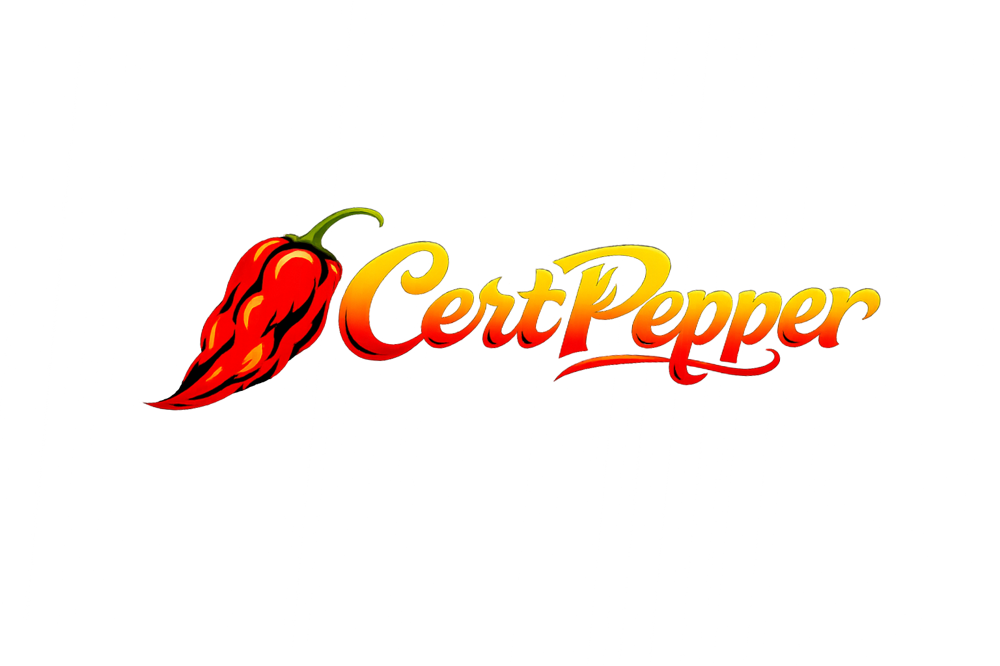

# CertPepper

<div align="center">
  <br>
  <em><strong>IT LEARNS WHAT YOU DON'T KNOW.</strong></em>
  <br><br>
  <a href="https://github.com/cert-pepper/cert-pepper/actions/workflows/ci.yml"></a>
  <a href="https://www.python.org/downloads/"></a>
  <a href="LICENSE"></a>
</div>

<p align="center">
Adaptive CLI study tool for IT certification exams — FSRS spaced repetition meets AI-powered explanations.
</p>

<p align="center">
  <a href="#quick-start">Quick Start</a> ·
  <a href="#why-certpepper">Why CertPepper?</a> ·
  <a href="#features">Features</a> ·
  <a href="#mcp-integration">MCP Integration</a> ·
  <a href="docs/content-format.md">Content Format</a> ·
  <a href="CONTRIBUTING.md">Contributing</a>
</p>

<p align="center">
  
</p>

## Quick Start

```bash
# Clone and install
git clone https://github.com/cert-pepper/cert-pepper.git && cd cert-pepper
cp .env.example .env          # add ANTHROPIC_API_KEY for AI explanations
uv sync

# Set up a database and start studying
uv run cert-pepper db init
uv run cert-pepper ingest     # loads the bundled Security+ content
uv run cert-pepper study
```

Or open the repo in **Claude Code** and ask it to generate a question bank for any exam:

> Set up a question bank for the CISSP exam

See [MCP Integration](#mcp-integration) to enable the servers.

## Why CertPepper?

Most study tools — Anki, Quizlet, flashcard apps — treat every question the same. CertPepper adapts:

- **FSRS-4.5 spaced repetition** schedules reviews at optimal intervals based on your recall history — the same core algorithm behind Anki, tuned for exam prep.
- **Bayesian Knowledge Tracing** estimates mastery per domain and steers new questions toward your weakest areas, weighted by how much each domain counts on the real exam.
- **AI explanations** break down wrong answers with domain-specific context via Claude (MCP sampling in Claude Code, or the Anthropic API in CLI mode).
- **Domain-weighted scoring** predicts your exam score using actual exam weights, with a conservative prior for unseen material.
- **MCP integration** — study inside Claude Code with three servers for content, study sessions, and analytics.

## Features

| Command | What it does |
|---------|-------------|
| `cert-pepper study` | Adaptive study session — picks questions based on your weak spots |
| `cert-pepper study --domain 4 --count 15` | Target a specific domain |
| `cert-pepper study --new-questions` | Focus on unseen material |
| `cert-pepper exam` | 90-question timed mock exam with countdown |
| `cert-pepper progress` | Dashboard: domain accuracy, predicted score, pass probability, study streak |
| `cert-pepper goal set --exam-date 2026-03-09` | Set exam date, get a paced study calendar |
| `cert-pepper pregenerate` | Batch-generate AI explanations (requires API key) |
| `cert-pepper db init` | Create/reset the SQLite database |
| `cert-pepper ingest` | Parse markdown content into the DB |
| `cert-pepper upgrade` | Apply schema migrations and refresh content |

> **No guarantees.** Predicted scores and pass probabilities are estimates based on practice performance — not predictions of real exam outcomes.

## MCP Integration

Three STDIO MCP servers are registered in `.mcp.json`:

| Server | Purpose |
|--------|---------|
| `cert-pepper-study` | Start sessions, submit answers, get due cards |
| `cert-pepper-content` | Search questions, get explanations, look up acronyms |
| `cert-pepper-analytics` | Predict score, find weak areas, study recommendations |

Enable them in Claude Code by adding `enableAllProjectMcpServers: true` to `.claude/settings.local.json`.

In Claude Code, explanations use MCP sampling — no `ANTHROPIC_API_KEY` needed.

## Adding Your Own Exam

1. Create a content directory in CertPepper's [markdown format](docs/content-format.md).
2. Set `CONTENT_ROOT=/path/to/your/content` in `.env`.
3. Run `cert-pepper db init` and `cert-pepper ingest`.

The `examples/security-plus/` directory is a complete reference implementation with 228 questions, 135 flashcards, and 262 acronyms.

## Configuration

| Variable | Default | Description |
|----------|---------|-------------|
| `DB_PATH` | `./cert_pepper.db` | SQLite database path |
| `CONTENT_ROOT` | `./examples/security-plus` | Root of your exam content |
| `ANTHROPIC_API_KEY` | — | Required for CLI AI explanations (`study`, `pregenerate`). Not needed in Claude Code. |
| `HAIKU_MODEL` | `claude-haiku-4-5-20251001` | Model for AI explanations |
| `SONNET_MODEL` | `claude-sonnet-4-6` | Model for MCP sampling |
| `DEFAULT_SESSION_SIZE` | `10` | Questions per study session |
| `MASTERY_THRESHOLD` | `0.85` | BKT mastery cutoff |

## Repository Layout

```
cert-pepper/
├── cert_pepper/          — Python source (CLI, MCP servers, algorithms)
│   ├── cli/              — Typer commands
│   ├── mcp/              — Three FastMCP STDIO servers
│   ├── engine/           — FSRS, BKT, selector, scorer (pure Python)
│   ├── ingestion/        — Markdown parsers
│   ├── ai/               — Anthropic client + explainer
│   └── db/               — SQLAlchemy async engine + schema
├── tests/                — pytest suite
├── examples/
│   └── security-plus/    — Security+ SY0-701 exam content
└── docs/
    ├── walkthrough.md    — 10-day Security+ study guide
    └── content-format.md — Format spec for your own exam content
```

## Worked Example

The `examples/security-plus/` directory contains a complete Security+ SY0-701 exam prep set:

- 5 domains of notes
- 135 flashcards
- 228 practice questions across all 5 domains
- 262 acronyms

See [docs/walkthrough.md](docs/walkthrough.md) for a step-by-step guide to preparing for Security+ in 10 days.

## Contributing

See [CONTRIBUTING.md](CONTRIBUTING.md) for setup instructions, workflow, and PR guidelines.

## License

[MIT](LICENSE)
